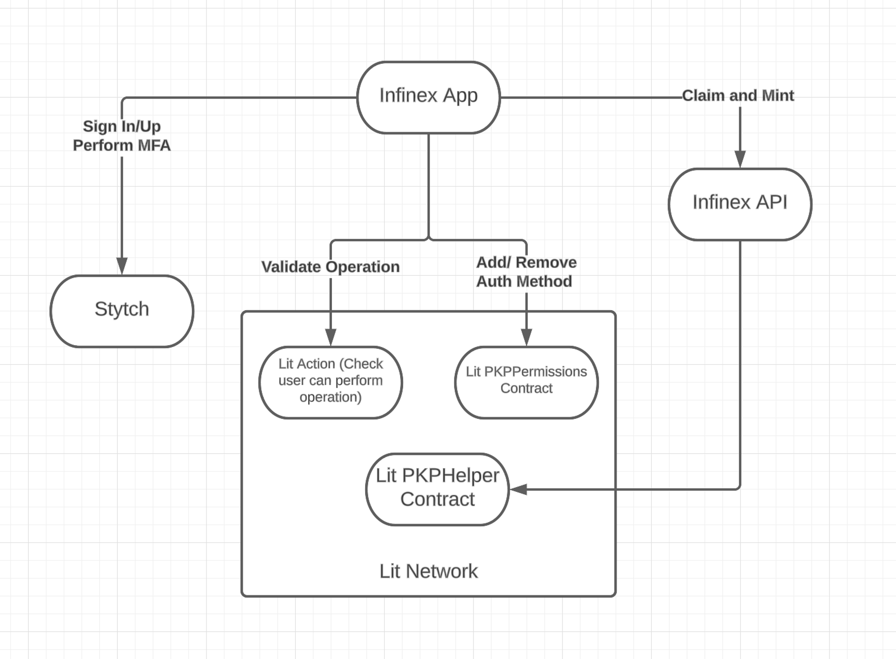
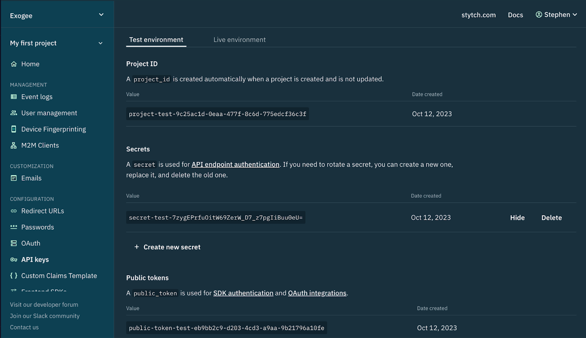
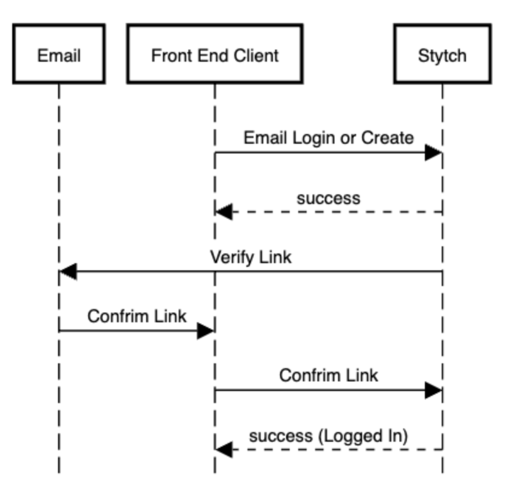
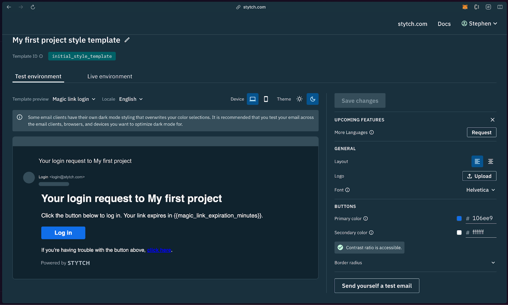
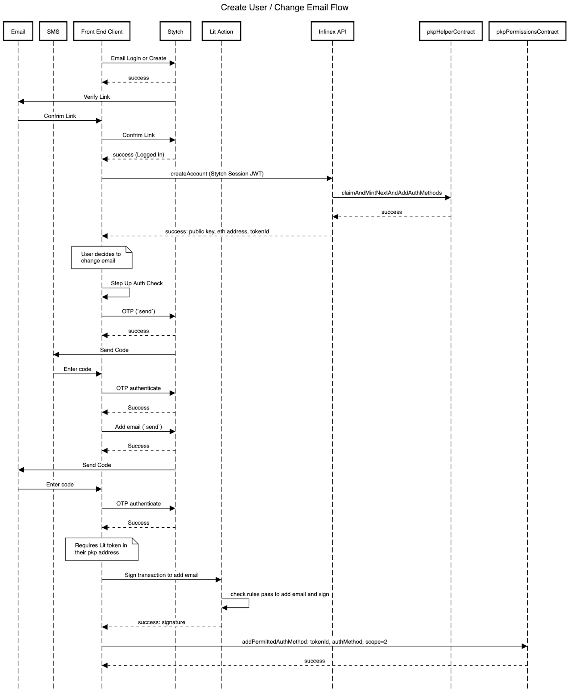
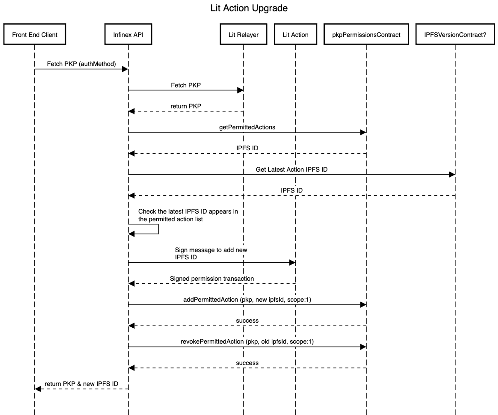

# Stytch and Lit Auxiliary file

## System Overview

In the Infinex app, there are two integrations for authentication and authorisation. They are Stych and Lit.

Stytch, a SaaS-based authentication platform, provides user sign-up, sign-in and MFA methods.

A user of the Infinex app will first create an account in Stytch (this happens transparently to the user), giving them access to the Infinex app.

Once the user is logged in, all authorisation will be confirmed using Lit. Lit is a decentralised key management system that allows a user to gain access to a private key used for signing transactions. Crucially, the user never has direct access to the private key. They can only access it using a Lit Action (more on this later).

A backend API is also needed to orchestrate the creation of this private key using a Programmable Key Pair (PKP) within the Lit network.

Here is the architecture overview of the system:

### System Responsibilities:

- Stytch - Is responsible for authentication within the system
- Lit Action - Is responsible for authorisation and checking permissions
- PKP (Programmable Key Pair) - Is responsible for holding the private keys of a user
- PKPHelper Contract - Is responsible for claiming and minting a new PKP for a user
- PKPPermissions Contract - Is responsible for adding or taking away permissions associated with a PKP

## How we use Stytch

Stytch is an authentication system that allows a user to create an account on the Infinex app and authenticate.

The Stytch integration happens in the front-end code, and all communication between the user’s browser is directly to Stytch. We do not proxy the requests via our Infinex backend, preventing any man-in-the-middle attacks and ensuring that an account cannot be compromised.

Once a user has authenticated with Stytch, they receive a session JWT, which verifies the user making a request.

All MFA methods belonging to the user are stored and held within Stytch.

The stytch dashboard does have a Secret that is available to perform API operations on behalf of a user. This secret has access to make changes to all the users within Stytch that are used in the Infinex app.

This will not be used within the system, and the number of admins with access to this secret should be reduced to the bare minimum, as it allows an admin to take control of an account.

Here is a secret shown as clear text in the Stytch admin area:

Next, let’s look at a sequence diagram that shows how the Sign Up user flow will work for Infinex:

As you can see in the above flow, the front-end code sends a create request to Stytch. Stytch will then send a verification email to the end user.

Once the user clicks the confirmation link, Stytch verifies it, and the user is logged in.

To customise any email sent from Stytch you can login to the Stytch admin area:

Once the user is authenticated and verified they are an authenticated user in Stytch.

This is where the responsibility of Stytch ends. It is only responsible for the authentication of the user and the management of MFA methods.

If a user adds a new phone number as an authentication factor, they can do that directly with Stytch.

However, to protect the user's account and to authorise any changes to their account, we use the Lit Protocol network to sign any transactions.

## How we use Lit Protocol

To perform operations within the Infinex app, a level of authorisation is required. Some of these operations include:

- Adding a new MFA device
- Removing an email address
- Adding a new phone number
- And many more…

The system that authorises the user to perform these operations is called Lit Protocol, and we use a few parts of their system to provide this authorisation:

- PKPHelper Contract - The smart contract that allows us to create a new PKP for each authenticated user in Stytch. There is one of these in the system.
- Lit Action - Our custom code that runs on the Lit network to check that a user is authorised to complete the operation. There is one of these in the system and the JS file is saved in IPFS.
- PKPPermissions Contract - A smart contract that we use to manage the auth methods, actions and addresses that have access to the PKP. There is one of these in the system.

Next, let’s look at each part of the system in more detail.

### PKPHelper Contract

When a user first creates their account we also create a PKP attached to their Stytch user account.

This PKP is created in our backend and requires us to manage an ETH address with Lit Tokens. This address is then used to claim and mint the PKP.

The PKP is created with specific permissions that allow only the following:

- Permitted Addresses: The PKP’s address (itself) is the only address that has access.
- Permitted Action: Our custom Lit Action is given access to the PKP so that it can validate the operation before signing a request. The action has a scope of “1” which means it can sign a transaction using the PKP private key.
- Permitted Auth Method: The permitted auth methods include the action from above and also the Stytch User. The Stytch user has a scope of “0” which means that they are **unable** to sign a transaction with the PKP private key.

The contract method claimAndMintNextAndAddAuthMethods is called with the following auth methods:

const claimArgs: PKPHelper.AuthMethodDataStruct = {

permittedAddresses: [],

permittedAddressScopes: [],

keyType: ethers.BigNumber.from("2"),

permittedAuthMethodIds: [authMethodId],

permittedAuthMethodTypes: [AuthMethodType.StytchOtp],

permittedAuthMethodPubkeys: ["0x"],

permittedAuthMethodScopes: [[ethers.BigNumber.from("0")]],

permittedIpfsCIDs: [`0x${Buffer.from(ipfsId).toString("hex")}`],

permittedIpfsCIDScopes: [[ethers.BigNumber.from("1")]],

addPkpEthAddressAsPermittedAddress: false,

sendPkpToItself: true,

};

Once we create the PKP for the user we can use the Lit Action to sign transactions on the user's behalf.

The minting process is a fixed cost. This price was **1 Wei** at the time of testing.

Next, let’s look at how we use the Lit Action.

### Lit Action

The Lit Action is similar to how an AWS Lambda works. You can execute custom JS within the Lit Network.

The Lit Action is stored in IPFS and is pulled into by the Lit Nodes for execution.

This custom JS is used in Infinex to confirm an operation can be performed.

At the start of the Lit Action code, we must ensure that the current user has permission to use this PKP. We do this by checking the “Permitting Auth Methods” on the PKP and comparing that to the resolved auth method on the “Lit.Auth”.

Once we have confirmed that this user has access to the PKP, we can then check the custom rules and whether the user needs to step up to perform the operation.

Let’s look at an example of adding a TOTP device.

To add a TOTP device we want to make sure that the user is not only authenticated but also that they have at least one other MFA method.

To do that, we can run the Lit Action with the currently logged-in user and check the authentication payload:

As you can see, we have authenticated with two factors: Email and Webauthn (Webauthn is used here as an example second MFA). In our Lit Action, we can check for these authentication factors and run rules.

For example, the following pseudocode checks if we have the required auth factors before signing the request:

if (operation === Operation.AddTotp) {

if (!auth_factors.includes(AuthFactor.WebAuthN)) {

throw new Error('You must step up authentication to perform operation');

}

}

Once all the rules have been passed we can confirm the transaction and it can be signed. This is performed in the lit action with this code:

await Lit.Actions.signEcdsa({ toSign, publicKey, sigName }),

In the above “toSign” is the transaction data that we want to send to the PKPPermissions contract. Let’s look at that next.

### PKPPermissions Contract

Once the Lit Action has verified the user has access to the PKP and has the required authentication factors to perform the transaction, it will sign the message.

Once this has happened we can then send it to the contract.

In our example, when adding a TOTP we would send a transaction to the PKPPermissions Contract to add a new auth method:

export async function addPermittedAuthMethod(

authMethod: AuthMethod,

pkp: IRelayPKP

) {

// 1. Setup the wallet

const pkpWallet = new PKPEthersWallet({

controllerAuthSig: await constructAuthSig(),

controllerAuthMethods: [authMethod], // Passing this param errors

litActionIPFS: import.meta.env.VITE_ACTION_CODE_IPFS_ID,

litNetwork: "cayenne",

pkpPubKey: pkp.publicKey,

});

// 2. Ensure the wallet signs using the action code

pkpWallet.useAction = true;

console.log("pkpWallet.address::", pkpWallet.address);

await pkpWallet.init();

// 3. Connect to the contracts

const litContracts = new LitContracts({

signer: pkpWallet,

});

await litContracts.connect();

// 4. Prepare the auth method payload

const newAuthMethod: LibPKPPermissionsStorage.AuthMethodStruct = {

authMethodType: AuthMethodType.StytchOtp,

id: ethers.utils.keccak256(ethers.utils.toUtf8Bytes("totp-device-A4EE4F45-CF68-4E43-A611-8B91F6C22581

")),

userPubkey: "0x",

};

// 5. Prepare the mock transaction to estimate gas

const mockTransaction =

await litContracts.pkpPermissionsContract.write.populateTransaction.addPermittedAuthMethod(

pkp.tokenId,

newAuthMethod,

[ethers.BigNumber.from("2")]

);

console.log("mockTransaction:: ", mockTransaction);

const gas = await litContracts.signer.estimateGas(mockTransaction);

console.log("gas:: ", gas);

// 6. Add the auth method by sending the transaction

return await litContracts.pkpPermissionsContract.write.addPermittedAuthMethod(

pkp.tokenId,

newAuthMethod,

[ethers.BigNumber.from("2")],

{ gasLimit: gas }

);

}

A sequence diagram of the complete end-to-end flow is below.

## Synchronisation

Synchronisation issues can occur when the Stytch account is successfully updated and the PKP permissions have not been.

To resolve this we will check that the user has added all of their authentication factors to the Lit permissions when starting the app.

For example, if the user has added a phone number to their account inside Stytch but lost internet connection before it was added to Lit.

We will check when the user is back online within the Infinex app to see if their Stytch authentication factors are in the PKP permissions set.

If we find that the PKP permissions do not contain the phone device then we will present a dialog/toast to resolve the conflict. This will be to authenticate using the required authentication factor (and a second MFA method) and update the contract.

### Removal of Authentication Factors

A user may also want to remove an authentication method. When this happens a similar process will be implemented.

First, the authentication factor is removed from Stytch, then, the authentication method will be removed from the PKP.

Upgrade Flow

